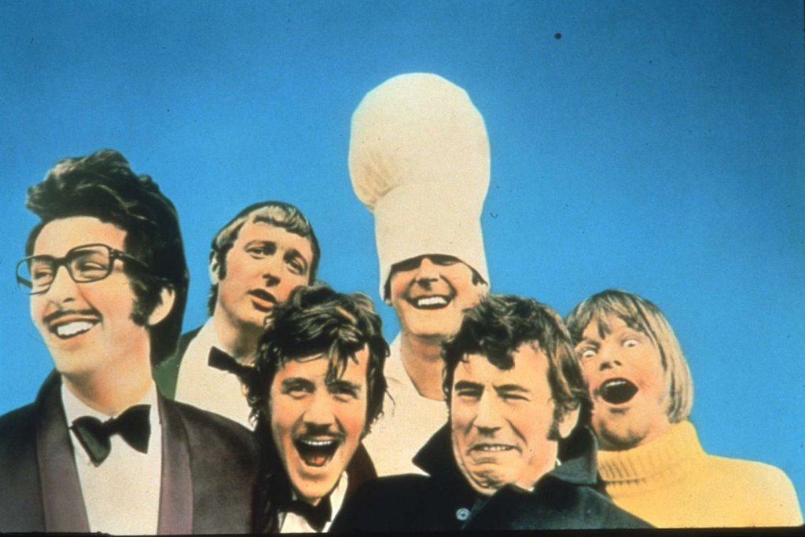

============
Introduction
============

History
-------

The Python programming language was developed by Guido van Rossum in the late 1980s at the `CWI (Centrum Wiskunde & Informatica)`_ in the Netherlands.

Python is a high-level (very abstract) programming language with emphasis on readability. It is free/open-source software and is available for all major platforms.

Because Python is a *dynamic* programming language (executed at runtime), it is also often used as a scripting language in various kinds of applications.

Python plays an important role in font production. All major font editors support scripting with Python.

Python Inside™
^^^^^^^^^^^^^^

The name Python was inspired by `Monty Python`_, the British comediants group. Many Python examples and tutorials use Monty Python-inspired terms such as ``spam`` and ``ni!``.

   Monty Python

Programming does not have to be serious or boring!

.. _CWI (Centrum Wiskunde & Informatica) : http://www.cwi.nl/
.. _Monty Python : https://en.wikipedia.org/wiki/Monty_python

Python 2.x vs Python 3
----------------------

Python 3 is a new version of Python which is not fully compatible with the 2.x branch. Some of the new features in Python 3 have been ported backwards to Python 2.6 and 2.7, and are available via the ``__future__`` module.

Python 3 is still not the default version in many production environments, since many important libraries have not been updated. Many systems still come with some version of Python 2.x pre-installed (for example, as of writing, the latest version of Mac OS X comes with Python 2.7.2).

We’ll have a look at the main differences between Python 2.x and 3 later, after we’ve learned the language basics. For now, it is enough to know that there are these two versions, and that we will be working with Python 2.x (probably 2.7.x for MacOSX 10.8+ users).

Python’s Design Philosophy
--------------------------

According to its creator Guido van Rossum, the following guidelines helped to make decisions while designing and implementing Python:

- Borrow ideas from elsewhere whenever it makes sense.
- “Things should be as simple as possible, but no simpler.” (Einstein)
- Do one thing well (The “UNIX philosophy”).
- Don’t fret too much about performance – plan to optimize later when needed.
- Don’t fight the environment and go with the flow.
- Don’t try for perfection because “good enough” is often just that.
- (Hence) it’s okay to cut corners sometimes, especially if you can do it right later.

The Zen of Python
^^^^^^^^^^^^^^^^^

The philosophy behind the design of the Python language is summarized in a series of aphorisms called 'The Zen of Python'. This text is available as an 'easter egg’ in all Python distributions. Simply type the following line of code in your favorite Python console::

    import this

...and the complete version of 'The Zen of Python' will be printed as output::

    Beautiful is better than ugly.  
    Explicit is better than implicit.  
    Simple is better than complex.  
    Complex is better than complicated.  
    Flat is better than nested.  
    Sparse is better than dense.  
    Readability counts.  
    ...  

Try it out for yourself to read the rest.

See also :)
^^^^^^^^^^^

.. code::

    import antigravity

.. code::

    from __future__ import braces
